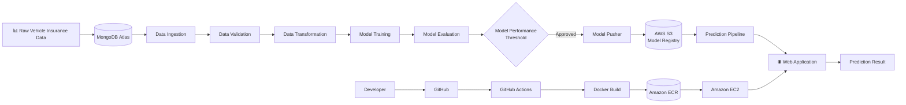
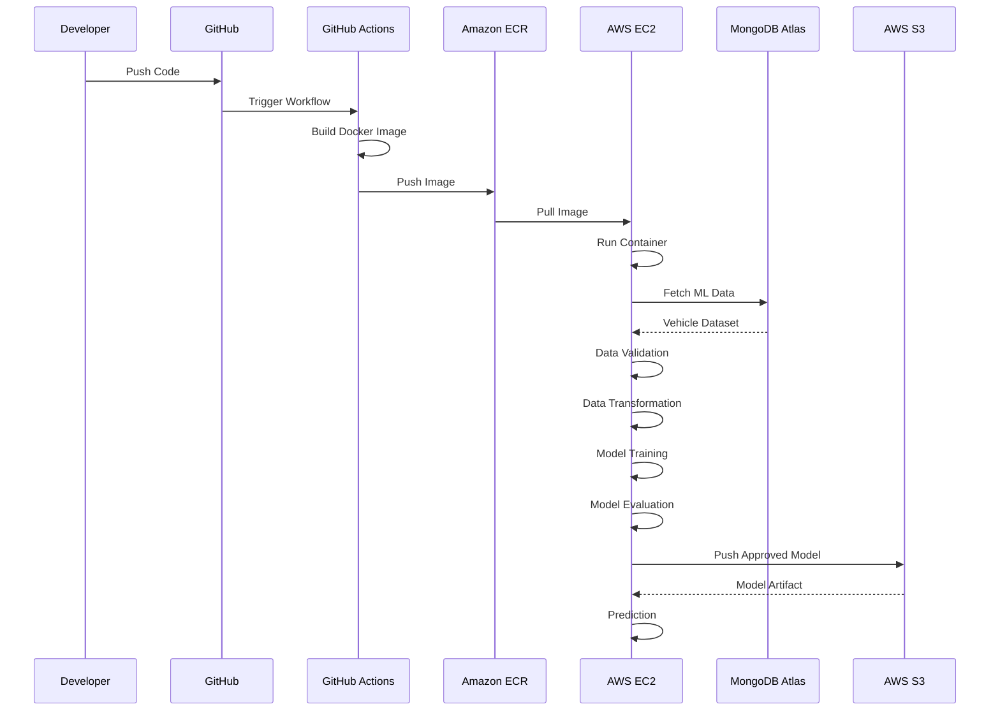

# 🚗 Vehicle Insurance Prediction — End-to-End MLOps Project

## 🌟 Project Overview

**Vehicle Insurance Prediction** is an end-to-end **Machine Learning + MLOps project** designed to demonstrate how a production-oriented ML system can be built, automated, containerized, deployed, and maintained using modern cloud and DevOps practices.

The project goes beyond model training by implementing the complete ML lifecycle:

> **Data → Data Ingestion → Data Validation → Data Transformation → Model Training → Model Evaluation → Model Registry → Deployment → Prediction**

It integrates **MongoDB Atlas** for data storage, **AWS S3** for model artifact management, **Docker** for containerization, **Amazon ECR** for image storage, **Amazon EC2** for deployment, and **GitHub Actions** for CI/CD automation.

### 🎯 What this project demonstrates

* 🧠 Machine Learning model development
* 📦 Modular and production-ready project architecture
* 🗄️ MongoDB Atlas integration
* 🔍 Automated data validation
* ⚙️ Feature engineering & data transformation
* 🤖 Automated model training
* 📊 Model evaluation
* 🏆 Model versioning / model registry using AWS S3
* ☁️ AWS cloud integration
* 🐳 Docker containerization
* 🔄 CI/CD with GitHub Actions
* 🖥️ AWS EC2 deployment
* 📦 AWS ECR container registry
* 🌐 Web-based prediction pipeline
* 🏗️ MLOps-oriented modular architecture
* 🔐 Environment-based configuration & secrets

---

# 🏗️ System Architecture



---

# 🔄 MLOps Lifecycle

```text
                     ┌─────────────────────┐
                     │   Vehicle Dataset   │
                     └──────────┬──────────┘
                                │
                                ▼
                     ┌─────────────────────┐
                     │  MongoDB Atlas      │
                     │   Data Storage      │
                     └──────────┬──────────┘
                                │
                                ▼
                    ┌──────────────────────┐
                    │   Data Ingestion     │
                    └──────────┬───────────┘
                               │
                               ▼
                    ┌──────────────────────┐
                    │   Data Validation     │
                    └──────────┬───────────┘
                               │
                               ▼
                    ┌──────────────────────┐
                    │ Data Transformation  │
                    │ Feature Engineering   │
                    └──────────┬───────────┘
                               │
                               ▼
                    ┌──────────────────────┐
                    │    Model Training    │
                    └──────────┬───────────┘
                               │
                               ▼
                    ┌──────────────────────┐
                    │   Model Evaluation   │
                    └──────────┬───────────┘
                               │
                         Performance OK?
                          /           \
                        No             Yes
                        │               │
                        ▼               ▼
                   Stop Pipeline    Model Pusher
                                        │
                                        ▼
                              ┌───────────────────┐
                              │    AWS S3         │
                              │  Model Registry   │
                              └─────────┬─────────┘
                                        │
                                        ▼
                              Prediction Pipeline
                                        │
                                        ▼
                              Dockerized Application
                                        │
                                        ▼
                                    AWS EC2
```

---

# 🧩 Project Architecture

The project follows a modular architecture separating configuration, entities, components, utilities, pipelines, and deployment logic.

```text
Vehicle-Insurance-Prediction-MLOps/
│
├── .github/
│   └── workflows/
│       └── aws.yaml
│
├── .gitignore
├── Dockerfile
├── .dockerignore
├── README.md
├── requirements.txt
├── setup.py
├── pyproject.toml
├── template.py
│
├── config/
│   └── schema.yaml
│
├── notebook/
│   ├── dataset.csv
│   ├── mongoDB_demo.ipynb
│   └── EDA_Feature_Engineering.ipynb
│
├── src/
│   └── vehicle_insurance/
│       │
│       ├── components/
│       │   ├── data_ingestion.py
│       │   ├── data_validation.py
│       │   ├── data_transformation.py
│       │   ├── model_trainer.py
│       │   ├── model_evaluation.py
│       │   └── model_pusher.py
│       │
│       ├── configuration/
│       │   ├── mongo_db_connections.py
│       │   └── aws_connection.py
│       │
│       ├── data_access/
│       │   └── proj1_data.py
│       │
│       ├── entity/
│       │   ├── config_entity.py
│       │   ├── artifact_entity.py
│       │   ├── estimator.py
│       │   └── s3_estimator.py
│       │
│       ├── pipeline/
│       │   ├── training_pipeline.py
│       │   └── prediction_pipeline.py
│       │
│       ├── utils/
│       │   ├── main_utils.py
│       │   ├── logger.py
│       │   └── exception.py
│       │
│       └── aws_storage/
│
├── static/
├── templates/
│
├── app.py
└── demo.py
```

---

# 🛠️ Technology Stack

| Category             | Technology                      |
| -------------------- | ------------------------------- |
| Programming Language | 🐍 Python 3.10                  |
| Machine Learning     | Scikit-learn                    |
| Data Processing      | Pandas, NumPy                   |
| Data Analysis        | Jupyter Notebook                |
| Database             | MongoDB Atlas                   |
| Cloud Platform       | AWS                             |
| Object Storage       | Amazon S3                       |
| Container Registry   | Amazon ECR                      |
| Compute              | Amazon EC2                      |
| Containerization     | Docker                          |
| CI/CD                | GitHub Actions                  |
| Source Control       | Git & GitHub                    |
| Web Application      | Flask / FastAPI                 |
| Configuration        | YAML                            |
| Package Management   | pip / setup.py / pyproject.toml |
| Environment          | Conda / Virtual Environment     |
| Model Storage        | AWS S3                          |
| Deployment           | Docker + AWS EC2                |

---

# ⭐ Key Features

## 1. 📊 MongoDB Atlas Data Integration

The project uses **MongoDB Atlas** as the primary data source.

The pipeline:

```text
MongoDB Atlas
      ↓
Connection
      ↓
Fetch Documents
      ↓
Convert Key-Value Data
      ↓
Pandas DataFrame
      ↓
ML Pipeline
```

The database layer is isolated from the ML components through a dedicated data-access layer.

---

## 2. 📥 Automated Data Ingestion

The **Data Ingestion** component retrieves data from MongoDB and creates artifacts required by downstream ML components.

### Workflow

```text
MongoDB
   ↓
Database Connection
   ↓
Fetch Data
   ↓
Convert to DataFrame
   ↓
Train/Test Dataset
   ↓
Data Ingestion Artifact
```

---

## 3. 🔍 Data Validation

The validation component checks whether incoming data satisfies the expected dataset schema.

Validation configuration is maintained in:

```text
config/schema.yaml
```

This provides a centralized location for defining:

* Dataset columns
* Data types
* Number of columns
* Expected schema
* Validation requirements

---

## 4. ⚙️ Data Transformation

The transformation stage prepares raw data for model training.

Typical operations include:

* Missing-value handling
* Feature engineering
* Numerical transformation
* Categorical encoding
* Feature selection
* Train/test preparation
* Scikit-learn preprocessing pipelines

---

## 5. 🤖 Model Training

The **Model Trainer** component trains the machine learning model using the transformed dataset.

The model-training workflow is encapsulated inside reusable classes so that training can be triggered programmatically through the training pipeline.

```text
Transformed Data
      ↓
Model Training
      ↓
Trained Model
      ↓
Model Artifact
```

---

# 📈 Model Evaluation

Before a trained model is pushed to the model registry, its performance is evaluated against a configured threshold.

```python
MODEL_EVALUATION_CHANGED_THRESHOLD_SCORE = 0.02
```

This helps prevent an inferior model from automatically replacing the existing model.

### Evaluation workflow

```text
New Model
    │
    ▼
Evaluate
    │
    ▼
Compare with Existing Model
    │
    ├── ❌ Below Threshold → Reject
    │
    └── ✅ Meets Threshold → Push
```

---

# ☁️ AWS Model Registry

Approved models are stored in **Amazon S3**, providing centralized model artifact storage.

### Configuration

```text
MODEL_BUCKET_NAME = "my-model-mlopsproj"
MODEL_PUSHER_S3_KEY = "model-registry"
```

Architecture:

```text
Model Trainer
      ↓
Model Evaluation
      ↓
Model Pusher
      ↓
AWS S3
      ↓
Model Registry
```

The project includes an `s3_estimator.py` implementation for interacting with the S3-based model storage layer.

---

# 🐳 Docker Containerization

The application is packaged as a Docker container to provide a consistent runtime environment.

### Container workflow

```text
Source Code
     ↓
Dockerfile
     ↓
Docker Image
     ↓
Amazon ECR
     ↓
Amazon EC2
     ↓
Running Application
```

This makes the application portable across development and deployment environments.

---

# 🔄 CI/CD Pipeline

The project implements an automated CI/CD workflow using **GitHub Actions**.

```mermaid
flowchart LR

    A[Developer] --> B[Git Push]

    B --> C[GitHub Repository]

    C --> D[GitHub Actions]

    D --> E[Build Docker Image]

    E --> F[Authenticate AWS]

    F --> G[Push Image to ECR]

    G --> H[Deploy to EC2]

    H --> I[Restart Application]

    I --> J[🚀 Production Application]
```



### Pipeline components

* GitHub repository
* GitHub Actions
* Self-hosted GitHub Runner
* Docker
* AWS IAM
* Amazon ECR
* Amazon EC2

---

# 🖥️ Self-Hosted GitHub Runner

The project uses an **AWS EC2 Ubuntu instance as a self-hosted GitHub Actions runner**.

```text
GitHub
   │
   │ GitHub Actions
   ▼
Self-Hosted Runner
   │
   ▼
AWS EC2
   │
   ├── Docker
   ├── Application
   └── Deployment
```

This allows CI/CD workflows to execute deployment tasks directly within the configured EC2 environment.

---

# 📦 Amazon ECR

Docker images are stored in **Amazon Elastic Container Registry (ECR)**.

Example repository:

```text
vehicleproj
```

Deployment flow:

```text
GitHub
   ↓
GitHub Actions
   ↓
Docker Build
   ↓
Docker Image
   ↓
Amazon ECR
   ↓
AWS EC2
```

---

# ☁️ AWS EC2 Deployment

The application runs inside a Docker container on an Ubuntu-based EC2 instance.

Example infrastructure:

```text
AWS EC2
├── Ubuntu Server
├── Docker
├── GitHub Self-Hosted Runner
└── Vehicle Insurance Application
```

The application can then be accessed through the EC2 public IP and configured application port.

Example:

```text
http://<EC2-PUBLIC-IP>:5080
```

---

# 🔮 Prediction Pipeline

The prediction pipeline is responsible for serving predictions using the trained model.

```text
User Input
    ↓
Web Application
    ↓
Prediction Pipeline
    ↓
Load Trained Model
    ↓
Preprocessing
    ↓
Model Inference
    ↓
Prediction
    ↓
Response
```

The application structure contains:

```text
app.py
static/
templates/
src/
```

---

# 🧪 Training Endpoint

The deployed application can also expose a training route for triggering model training.

Example:

```text
/training
```

This demonstrates how model training can be integrated into an application-level MLOps workflow.

---

# 📝 Logging & Exception Handling

The project includes dedicated modules for:

```text
logger.py
exception.py
```

### Logging

Provides structured logging for tracking application and pipeline execution.

### Exception Handling

Centralized exception handling improves debugging and makes pipeline failures easier to identify.

Example architecture:

```text
Pipeline Component
       ↓
Exception Occurs
       ↓
Custom Exception
       ↓
Logger
       ↓
Detailed Error Information
```

---

# 🔐 Configuration & Secrets

Sensitive credentials are intentionally managed through environment variables rather than hard-coded into the source code.

### MongoDB

```bash
export MONGODB_URL="mongodb+srv://<username>:<password>@..."
```

### AWS

```bash
export AWS_ACCESS_KEY_ID="..."
export AWS_SECRET_ACCESS_KEY="..."
export AWS_DEFAULT_REGION="us-east-1"
```

For PowerShell:

```powershell
$env:MONGODB_URL="mongodb+srv://<username>:<password>@..."

$env:AWS_ACCESS_KEY_ID="..."
$env:AWS_SECRET_ACCESS_KEY="..."
$env:AWS_DEFAULT_REGION="us-east-1"
```

> ⚠️ **Never commit AWS credentials, MongoDB passwords, API keys, or other secrets to GitHub.**

For CI/CD, secrets are stored using **GitHub Repository Secrets**.

Example:

```text
AWS_ACCESS_KEY_ID
AWS_SECRET_ACCESS_KEY
AWS_DEFAULT_REGION
ECR_REPO
```

---

# 🚀 Getting Started

## 1️⃣ Clone the Repository

```bash
git clone <YOUR-GITHUB-REPOSITORY-URL>

cd Vehicle-Insurance-Prediction-MLOps
```

---

## 2️⃣ Generate Project Template

Execute:

```bash
python template.py
```

This creates the initial project structure.

---

## 3️⃣ Configure Python Package

The project uses:

```text
setup.py
pyproject.toml
```

These files allow local source packages to be installed and imported cleanly.

For additional explanation, refer to:

```text
crashcourse.txt
```

---

# 🐍 Environment Setup

Create the Conda environment:

```bash
conda create -n vehicle python=3.10 -y
```

Activate it:

```bash
conda activate vehicle
```

Install dependencies:

```bash
pip install -r requirements.txt
```

Verify installed packages:

```bash
pip list
```

---

# 🗄️ MongoDB Atlas Setup

## Step 1 — Create MongoDB Atlas Account

Create a MongoDB Atlas project.

## Step 2 — Create Cluster

Select:

```text
M0 Free Tier
```

and create the deployment.

## Step 3 — Create Database User

Configure:

```text
Username
Password
```

## Step 4 — Configure Network Access

Add the required IP address/network access configuration.

For development/testing, the original project uses:

```text
0.0.0.0/0
```

> ⚠️ For production deployments, restrict network access to trusted IP ranges instead of allowing access from anywhere.

## Step 5 — Get Connection String

Navigate to:

```text
MongoDB Atlas
 → Database
 → Connect
 → Drivers
 → Python
```

Copy the connection string and replace the password placeholder.

---

# 📓 Notebook Setup

Create:

```text
notebook/
```

Add:

```text
mongoDB_demo.ipynb
EDA_Feature_Engineering.ipynb
```

Select the:

```text
vehicle
```

Python environment as the notebook kernel.

The MongoDB notebook demonstrates:

```text
Dataset
   ↓
Python Notebook
   ↓
MongoDB Atlas
   ↓
Database Collection
```

The EDA notebook covers exploratory analysis and feature engineering.

---

# 🔄 Complete Training Pipeline

The training workflow follows the architecture:

```text
Constants
    ↓
Configuration Entity
    ↓
Artifact Entity
    ↓
Data Access
    ↓
Data Ingestion
    ↓
Data Validation
    ↓
Data Transformation
    ↓
Model Training
    ↓
Model Evaluation
    ↓
Model Pusher
    ↓
AWS S3
```

The major pipeline modules are organized under:

```text
src/
├── components/
├── configuration/
├── data_access/
├── entity/
├── pipeline/
├── utils/
└── aws_storage/
```

---

# ☁️ AWS Setup

The project uses AWS services for cloud-based model management and application deployment.

### AWS Services

| AWS Service    | Purpose                               |
| -------------- | ------------------------------------- |
| IAM            | Identity & access management          |
| S3             | Model artifact/model registry storage |
| ECR            | Docker image registry                 |
| EC2            | Application hosting                   |
| GitHub Actions | CI/CD automation                      |

Recommended region used in this project:

```text
us-east-1
```

---

# 🪣 S3 Model Storage

Create an S3 bucket for model artifacts.

Example:

```text
my-model-mlopsproj
```

Model path:

```text
model-registry/
```

The Model Pusher uploads approved model artifacts to S3.

---

# 🐳 Local Docker Build

Build the image:

```bash
docker build -t vehicleproj .
```

Run the container:

```bash
docker run -p 5080:5080 vehicleproj
```

The application can then be accessed through:

```text
http://localhost:5080
```

---

# 🔄 CI/CD Setup

## GitHub Actions

Workflow configuration:

```text
.github/
└── workflows/
    └── aws.yaml
```

The pipeline is triggered after code is pushed to GitHub.

```text
git add .
git commit -m "Update ML pipeline"
git push
```

↓

```text
GitHub Actions
```

↓

```text
Docker Build
```

↓

```text
Amazon ECR
```

↓

```text
AWS EC2
```

↓

```text
🚀 Application Deployment
```

---

# 🖥️ EC2 Setup

Create an Ubuntu EC2 instance.

Example configuration:

```text
Operating System : Ubuntu
Instance Type    : T2 Medium
Storage          : 30 GB
```

Install Docker:

```bash
curl -fsSL https://get.docker.com -o get-docker.sh

sudo sh get-docker.sh

sudo usermod -aG docker ubuntu

newgrp docker
```

Verify:

```bash
docker --version
```

---

# 🔗 GitHub Self-Hosted Runner

Configure the EC2 machine as a GitHub self-hosted runner.

Navigate to:

```text
GitHub
 → Repository
 → Settings
 → Actions
 → Runners
 → New self-hosted runner
```

Select:

```text
Linux
```

Then execute the commands provided by GitHub on the EC2 instance.

The runner can be verified from:

```text
GitHub
 → Settings
 → Actions
 → Runners
```

Expected state:

```text
Idle
```

---

# 🔐 GitHub Repository Secrets

Configure the following repository secrets:

```text
AWS_ACCESS_KEY_ID
AWS_SECRET_ACCESS_KEY
AWS_DEFAULT_REGION
ECR_REPO
```

These secrets are consumed by the GitHub Actions workflow.

---

# 🌐 Application Deployment

After the CI/CD pipeline deploys the application to EC2, configure the required inbound port in the EC2 Security Group.

Example:

```text
Protocol : TCP
Port     : 5080
```

Then access:

```text
http://<EC2-PUBLIC-IP>:5080
```

---

# 🧪 Project Workflow Summary



---

# 🎯 MLOps Concepts Demonstrated

This project demonstrates several concepts commonly used in production ML systems:

### Machine Learning

* Exploratory Data Analysis
* Feature Engineering
* Data Transformation
* Model Training
* Model Evaluation
* Prediction Pipeline

### MLOps

* Modular ML architecture
* Pipeline orchestration
* Artifact management
* Model evaluation gates
* Model registry
* Model versioning
* Reproducible environments
* Configuration management
* Logging
* Exception handling

### DevOps

* Git
* GitHub
* GitHub Actions
* CI/CD
* Docker
* Self-hosted runners
* Container deployment

### Cloud

* AWS IAM
* AWS S3
* AWS ECR
* AWS EC2
* Cloud-based model storage
* Cloud deployment

### Data Engineering

* MongoDB Atlas
* Data ingestion
* Schema validation
* Data transformation
* Data pipelines

---

# 💼 Recruiter Highlights

### What makes this project relevant to an MLOps / ML Engineer role?

| Capability               | Demonstrated Through                   |
| ------------------------ | -------------------------------------- |
| 🧠 ML Development        | Training & prediction pipeline         |
| 🔄 MLOps                 | End-to-end ML lifecycle                |
| ☁️ AWS                   | S3, ECR, EC2, IAM                      |
| 🐳 Docker                | Containerized deployment               |
| 🔁 CI/CD                 | GitHub Actions                         |
| 🗄️ Database             | MongoDB Atlas                          |
| 📦 Model Registry        | AWS S3                                 |
| 🔍 Data Validation       | Schema-based validation                |
| ⚙️ Feature Engineering   | Transformation pipeline                |
| 🧪 Model Evaluation      | Performance threshold                  |
| 📝 Observability         | Logging & exception handling           |
| 🚀 Deployment            | AWS EC2                                |
| 🔐 Secrets Management    | Environment variables & GitHub Secrets |
| 🏗️ Software Engineering | Modular package architecture           |

---

# 📌 Engineering Practices

The project follows several production-oriented engineering principles:

* Modular code organization
* Separation of concerns
* Reusable ML components
* Configuration-driven validation
* Environment-based secrets
* Artifact-based pipeline execution
* Centralized logging
* Custom exception handling
* Containerized deployment
* Automated CI/CD
* Cloud-based model storage
* Automated deployment workflow

---

# 🔮 Future Enhancements

The architecture can be extended further with:

* 📊 MLflow experiment tracking
* 📈 Model performance monitoring
* 🔎 Data drift detection
* 🤖 Automated retraining
* 📦 Model versioning with MLflow
* ☁️ AWS SageMaker integration
* 🔐 AWS Secrets Manager
* ⚡ FastAPI-based inference service
* 📊 Prometheus + Grafana monitoring
* 🧪 Automated unit/integration testing
* 🔄 Blue/Green deployment
* 🚀 Kubernetes deployment
* 📡 Real-time model monitoring
* 🧠 Explainable AI with SHAP
* 🛡️ Automated model quality gates

---

# 📂 Important Files

| File / Directory             | Purpose                             |
| ---------------------------- | ----------------------------------- |
| `template.py`                | Creates project structure           |
| `setup.py`                   | Python package configuration        |
| `pyproject.toml`             | Modern Python project configuration |
| `requirements.txt`           | Project dependencies                |
| `config/schema.yaml`         | Dataset schema configuration        |
| `components/`                | ML pipeline components              |
| `configuration/`             | Database & AWS configuration        |
| `data_access/`               | Database access layer               |
| `entity/`                    | Configuration & artifact entities   |
| `pipeline/`                  | Training & prediction pipelines     |
| `utils/`                     | Logging, exceptions & utilities     |
| `Dockerfile`                 | Container image definition          |
| `.dockerignore`              | Docker build exclusions             |
| `.github/workflows/aws.yaml` | CI/CD workflow                      |
| `app.py`                     | Application entry point             |
| `notebook/`                  | EDA & database experimentation      |

---

# 🚀 Quick Start

```bash
# Clone repository
git clone <YOUR-REPOSITORY-URL>

cd Vehicle-Insurance-Prediction-MLOps

# Create environment
conda create -n vehicle python=3.10 -y

# Activate environment
conda activate vehicle

# Install dependencies
pip install -r requirements.txt

# Configure MongoDB
export MONGODB_URL="<YOUR-MONGODB-CONNECTION-STRING>"

# Configure AWS
export AWS_ACCESS_KEY_ID="<YOUR-AWS-ACCESS-KEY>"
export AWS_SECRET_ACCESS_KEY="<YOUR-AWS-SECRET-KEY>"
export AWS_DEFAULT_REGION="us-east-1"

# Run application
python app.py
```

---

# 📊 End-to-End Architecture at a Glance

```text
                    ┌───────────────────────────┐
                    │        GitHub             │
                    │      Source Control       │
                    └─────────────┬─────────────┘
                                  │
                                  ▼
                    ┌───────────────────────────┐
                    │     GitHub Actions        │
                    │        CI / CD             │
                    └─────────────┬─────────────┘
                                  │
                                  ▼
                    ┌───────────────────────────┐
                    │          Docker           │
                    │      Containerization      │
                    └─────────────┬─────────────┘
                                  │
                                  ▼
                    ┌───────────────────────────┐
                    │       Amazon ECR          │
                    │     Container Registry     │
                    └─────────────┬─────────────┘
                                  │
                                  ▼
                    ┌───────────────────────────┐
                    │        Amazon EC2         │
                    │     Application Server    │
                    └─────────────┬─────────────┘
                                  │
                   ┌──────────────┴──────────────┐
                   │                             │
                   ▼                             ▼
        ┌─────────────────────┐       ┌─────────────────────┐
        │   MongoDB Atlas     │       │      AWS S3         │
        │   Data Storage      │       │   Model Registry    │
        └──────────┬──────────┘       └──────────▲──────────┘
                   │                             │
                   ▼                             │
        ┌─────────────────────┐                  │
        │   Data Ingestion    │                  │
        └──────────┬──────────┘                  │
                   ▼                             │
        ┌─────────────────────┐                  │
        │  Data Validation    │                  │
        └──────────┬──────────┘                  │
                   ▼                             │
        ┌─────────────────────┐                  │
        │ Data Transformation │                  │
        └──────────┬──────────┘                  │
                   ▼                             │
        ┌─────────────────────┐                  │
        │   Model Training    │                  │
        └──────────┬──────────┘                  │
                   ▼                             │
        ┌─────────────────────┐                  │
        │  Model Evaluation   │──────────────────┘
        └──────────┬──────────┘
                   │
                   ▼
        ┌─────────────────────┐
        │ Prediction Pipeline │
        └──────────┬──────────┘
                   │
                   ▼
        ┌─────────────────────┐
        │   🌐 Web App        │
        │ Vehicle Prediction  │
        └─────────────────────┘
```

---

# 👨‍💻 Author

### **Akshay Parate**

**Machine Learning Engineer | MLOps | AWS | Generative AI**

🔗 GitHub: **AkshayParate61**

🔗 LinkedIn: **Akshay Parate**

---

# ⭐ If You Find This Project Useful

If this project helps you understand **MLOps, ML pipelines, AWS deployment, Docker, or CI/CD**, consider giving the repository a ⭐.

**Feedback, suggestions, and contributions are welcome!**

---

<p align="center">

### 🚀 Build → Train → Evaluate → Register → Containerize → Deploy → Predict

**End-to-End Machine Learning, MLOps & Cloud Deployment**

</p>

